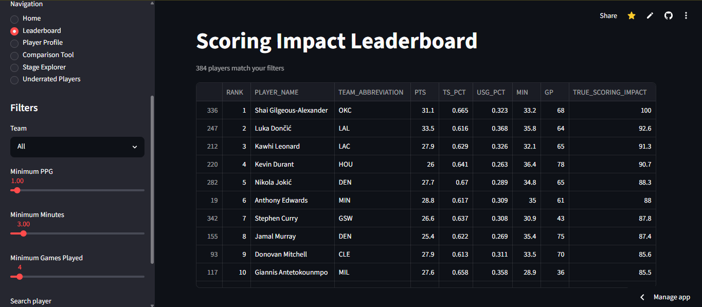

Link to the Web App: [clutch-analytics](https://clutch-analytics.streamlit.app)

# NBA True Scoring Value Model

## Project goal
Build an advanced analytics model that estimates individual NBA players true scoring value/impact that traditional box score statistics like PPG and FG%, as well as advanced metrics such as usg% and ts% are incapable of doing. 

## Tech Stack
Python, Pandas, NumPy, scikit-learn, Plotly, Streamlit

## Project Structure
data/        → raw and cleaned datasets
models/      → scoring impact model files
app/         → Streamlit web app
notebooks/   → EDA and analysis

## EDA Findings

- High PPG does not equal high efficiency. Elite scorers like SGA and 
  Jokić score fewer points than Luka but shoot far more efficiently.

- As usage rate increases, efficiency regresses toward the league mean. 
  Elite players who maintain high efficiency at high usage are beating 
  the expected tradeoff.

- Scoring is right skewed (most players average 5-15 PPG), making 20+ 
  PPG scorers statistical outliers.

- Scoring volume (PTS) and efficiency (TS_PCT) have a weak correlation 
  (r = 0.25), confirming that PPG alone is a misleading measure of 
  scoring quality.

  

  
### What is the TSI Model (True Scoring Impact)

  - TSI is a model I created which essentially is a 0–100 composite metric that measures a player's true scoring impact across five weighted pipeline stages:

| Stage | Weight | What it measures |
|---|---|---|
| Volume | 25% | Scoring load: points, shot attempts, and usage rate |
| Efficiency | 25% | How efficiently a player scores relative to expected efficiency |
| Shot Difficulty | 25% | Scoring output on harder shots (pull-ups, mid-range, long 2s) |
| Game Context | 15% | Performance in clutch situations, home/away splits, and rest factors |
| Team Independence | 10% | How much scoring impact holds up independent of team system effects |

Each stage is individually scaled to 0–100 using min-max normalization before being combined into a final weighted TSI score. The model uses data sourced from NBA.com via the `nba_api` library and is rebuilt daily.

### Clutch Analytics (Turning the model building into a web app)

* **Home** — Overview of the project and TSI metric introduction
* **Leaderboard** — Full TSI rankings for all qualified players with filters for team, PPG, minutes, and games played
* **Player Profile** — Individual player breakdown across all five TSI stages with visualizations
* **Comparison Tool** — Side by side TSI stage comparison between two players
* **Stage Explorer** — Deep dive into each individual TSI stage with league wide distributions
* **Underrated Players** — Players whose TSI significantly exceeds their PPG ranking, identified via OLS regression
* **Today's Debate** — Daily randomized matchup between two players within 7 TSI points of each other
* **Draft Lab** — 8-team snake draft simulator with 82 game season simulation, best of 7playoffs, team fit adjustments, MVP and Finals MVP awards
* **Background** — EDA graphs, methodology report, formulas, and project information
